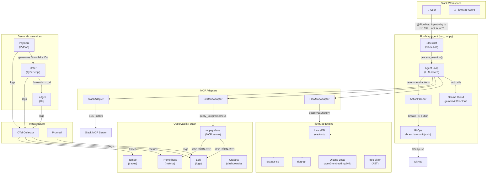
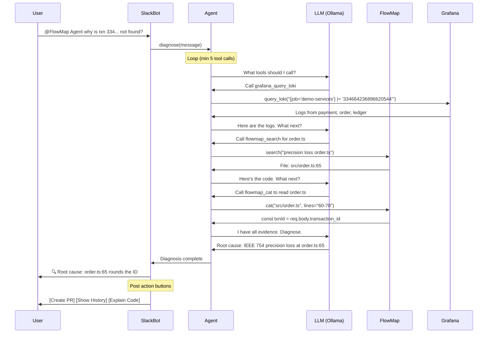
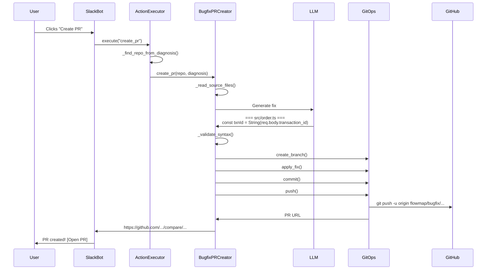
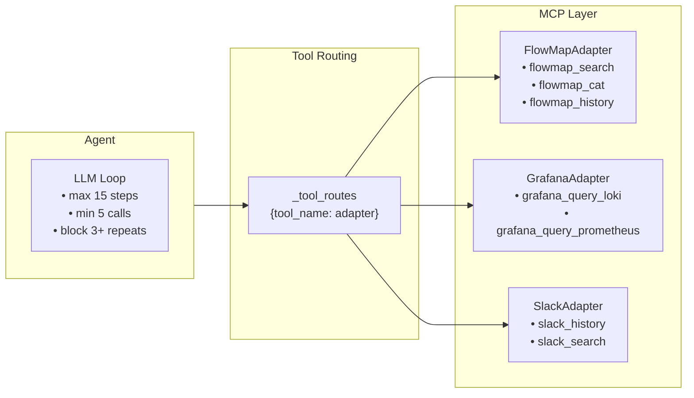
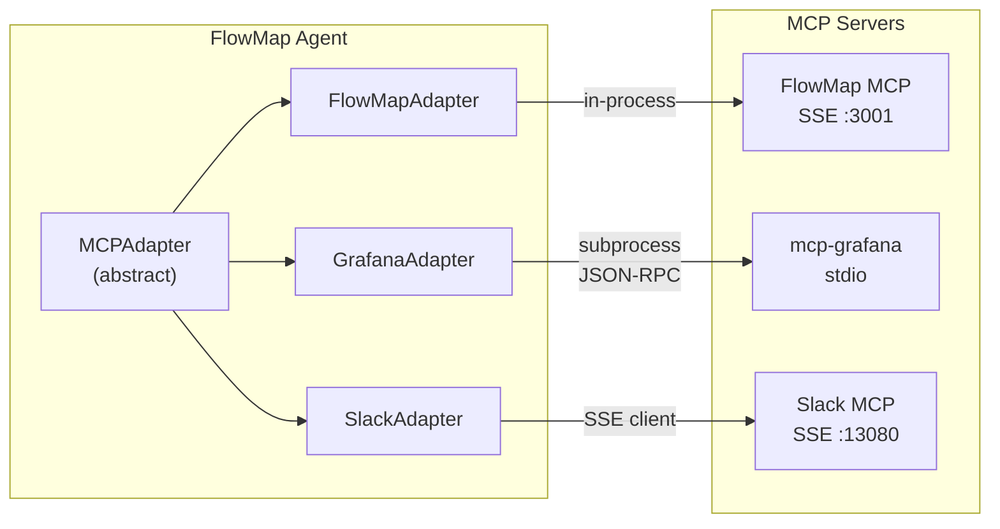

# FlowMap Agent — Architecture Diagram

## System Architecture

```mermaid
graph TB
    subgraph Slack["Slack Workspace"]
        User["👤 User"]
        Bot["🤖 FlowMap Agent"]
    end

    subgraph Agent["FlowMap Agent (run_bot.py)"]
        SlackBot["SlackBot<br/>(slack-bolt)"]
        AgentLoop["Agent Loop<br/>(LLM-driven)"]
        LLM["Ollama Cloud<br/>gemma4:31b-cloud"]
        Planner["ActionPlanner"]
        GitOps["GitOps<br/>(branch/commit/push)"]
    end

    subgraph Adapters["MCP Adapters"]
        FlowMap["FlowMapAdapter"]
        Grafana["GrafanaAdapter"]
        SlackMCP["SlackAdapter"]
    end

    subgraph FlowMapEngine["FlowMap Engine"]
        LanceDB["LanceDB<br/>(vectors)"]
        TreeSitter["tree-sitter<br/>(AST)"]
        OllamaEmb["Ollama Local<br/>qwen3-embedding:0.6b"]
        Ripgrep["ripgrep"]
        BM25["BM25/FTS"]
    end

    subgraph Observability["Observability Stack"]
        Loki["Loki<br/>(logs)"]
        Prometheus["Prometheus<br/>(metrics)"]
        Tempo["Tempo<br/>(traces)"]
        GrafanaUI["Grafana<br/>(dashboards)"]
        mcpGrafana["mcp-grafana<br/>(MCP server)"]
    end

    subgraph DemoServices["Demo Microservices"]
        Payment["Payment<br/>(Python)"]
        Order["Order<br/>(TypeScript)"]
        Ledger["Ledger<br/>(Go)"]
    end

    subgraph Infrastructure["Infrastructure"]
        OTelCollector["OTel Collector"]
        Promtail["Promtail"]
    end

    User -->|"@FlowMap Agent why is txn 334... not found?"| SlackBot
    SlackBot -->|"process_mention()"| AgentLoop
    AgentLoop -->|"tool calls"| LLM

    AgentLoop --> FlowMap
    AgentLoop --> Grafana
    AgentLoop --> SlackMCP

    FlowMap -->|"search/cat/history"| FlowMapEngine
    Grafana -->|"query_loki/prometheus"| mcpGrafana
    SlackMCP -->|"SSE :13080"| SlackMCP2["Slack MCP Server"]

    FlowMapEngine --> LanceDB
    FlowMapEngine --> TreeSitter
    FlowMapEngine --> OllamaEmb
    FlowMapEngine --> Ripgrep
    FlowMapEngine --> BM25

    mcpGrafana -->|"stdio JSON-RPC"| Loki
    mcpGrafana -->|"stdio JSON-RPC"| Prometheus

    AgentLoop -->|"recommend actions"| Planner
    Planner -->|"Create PR button"| GitOps
    GitOps -->|"SSH push"| GitHub["GitHub"]

    Payment -->|"generates Snowflake IDs"| Order
    Order -->|"forwards txn_id"| Ledger

    Payment -->|"logs"| OTelCollector
    Order -->|"logs"| OTelCollector
    Ledger -->|"logs"| OTelCollector

    OTelCollector -->|"logs"| Loki
    Promtail -->|"logs"| Loki
    OTelCollector -->|"metrics"| Prometheus
    OTelCollector -->|"traces"| Tempo
```

## Data Flow: Diagnosis

```mermaid
sequenceDiagram
    participant U as User
    participant S as SlackBot
    participant A as Agent
    participant L as LLM (Ollama)
    participant FM as FlowMap
    participant G as Grafana

    U->>S: @FlowMap Agent why is txn 334... not found?
    S->>A: diagnose(message)
    
    Note over A: Loop (min 5 tool calls)
    
    A->>L: What tools should I call?
    L->>A: Call grafana_query_loki
    
    A->>G: query_loki("{job='demo-services'} |= '334664236896620544'")
    G->>A: Logs from payment, order, ledger
    
    A->>L: Here are the logs. What next?
    L->>A: Call flowmap_search for order.ts
    
    A->>FM: search("precision loss order.ts")
    FM->>A: File: src/order.ts:65
    
    A->>L: Here's the code. What next?
    L->>A: Call flowmap_cat to read order.ts
    
    A->>FM: cat("src/order.ts", lines="60-70")
    FM->>A: const txnId = req.body.transaction_id
    
    A->>L: I have all evidence. Diagnose.
    L->>A: Root cause: IEEE 754 precision loss at order.ts:65
    
    A->>S: Diagnosis complete
    S->>U: 🔍 Root cause: order.ts:65 rounds the ID
    
    Note over S: Post action buttons
    S->>U: [Create PR] [Show History] [Explain Code]
```

## Data Flow: PR Creation

```mermaid
sequenceDiagram
    participant U as User
    participant S as SlackBot
    participant A as ActionExecutor
    participant B as BugfixPRCreator
    participant L as LLM
    participant G as GitOps
    participant GH as GitHub

    U->>S: Clicks "Create PR"
    S->>A: execute("create_pr")
    A->>A: _find_repo_from_diagnosis()
    A->>B: create_pr(repo, diagnosis)
    
    B->>B: _read_source_files()
    B->>L: Generate fix
    L->>B: === src/order.ts ===<br/>const txnId = String(req.body.transaction_id)
    
    B->>B: _validate_syntax()
    B->>G: create_branch()
    B->>G: apply_fix()
    B->>G: commit()
    B->>G: push()
    G->>GH: git push -u origin flowmap/bugfix/...
    
    G->>B: PR URL
    B->>S: https://github.com/.../compare/...
    S->>U: PR created! [Open PR]
```

## Component Diagram

```mermaid
graph LR
    subgraph MCP["MCP Layer"]
        direction TB
        FA["FlowMapAdapter<br/>• flowmap_search<br/>• flowmap_cat<br/>• flowmap_history"]
        GA["GrafanaAdapter<br/>• grafana_query_loki<br/>• grafana_query_prometheus"]
        SA["SlackAdapter<br/>• slack_history<br/>• slack_search"]
    end

    subgraph Tools["Tool Routing"]
        TR["_tool_routes<br/>{tool_name: adapter}"]
    end

    subgraph Agent["Agent"]
        Loop["LLM Loop<br/>• max 15 steps<br/>• min 5 calls<br/>• block 3+ repeats"]
    end

    Agent --> TR
    TR --> FA
    TR --> GA
    TR --> SA
```

## MCP Integration

```mermaid
graph LR
    subgraph Agent["FlowMap Agent"]
        AM["MCPAdapter<br/>(abstract)"]
        FA["FlowMapAdapter"]
        GA["GrafanaAdapter"]
        SA["SlackAdapter"]
    end

    subgraph MCP["MCP Servers"]
        FM["FlowMap MCP<br/>SSE :3001"]
        GM["mcp-grafana<br/>stdio"]
        SM["Slack MCP<br/>SSE :13080"]
    end

    AM --> FA
    AM --> GA
    AM --> SA

    FA -->|"in-process"| FM
    GA -->|"subprocess<br/>JSON-RPC"| GM
    SA -->|"SSE client"| SM
```
